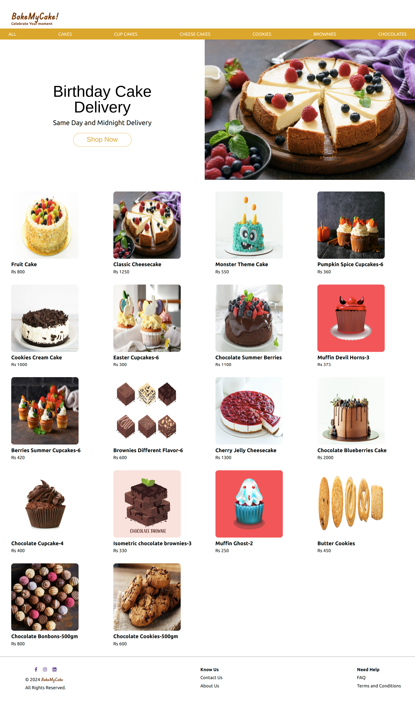
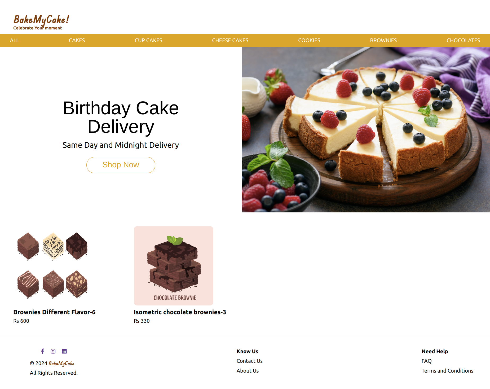
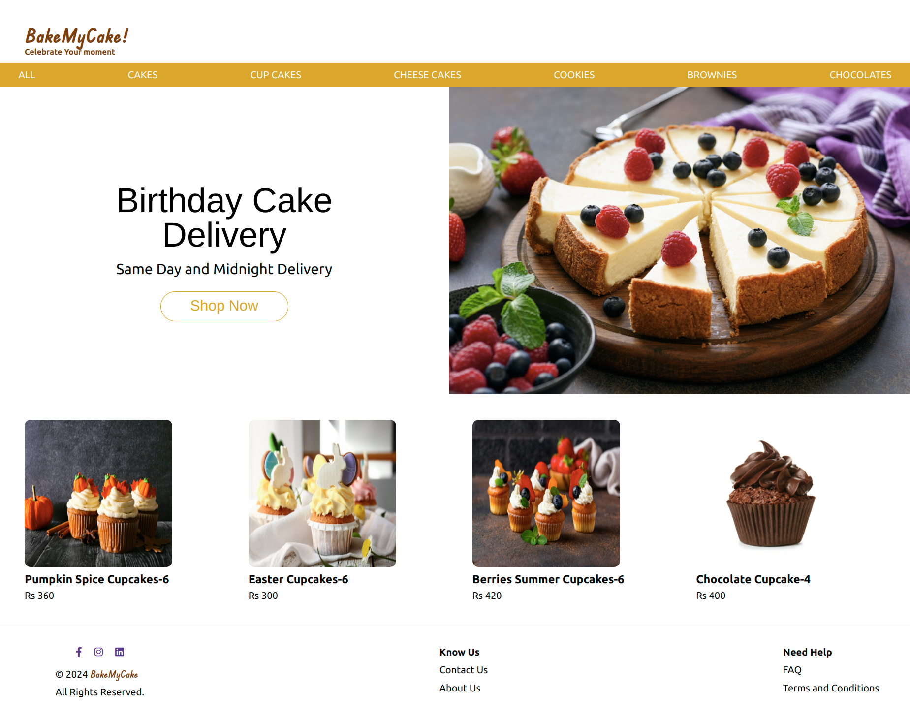

## Course End Project: Bake My Cake - Phase I

### Context

Cakes, cookies and brownies are all time favorites of young and old. No celebration is complete without these delicacies. The cake shops have started offering options to the customers to bake cakes as per their needs.

In addition, taking the advantage of widely used digital platform, the cake outlets offer options to customers to place their orders online.

This is a win-win situation for both the outlet as well as its customers. The outlets are able to reach to larger audience and the customers are able to enjoy the delicacies prepared by the popular outlet, served at their doorstep.

### Problem Statement

- Develop a single page application using React – Bake My Cake. This application will be developed in two phases.​
- Following are the tasks to be completed in the first phase:​
- The app should allow customers to view a list of cakes, cookies, or brownies available in the cake shop.​
  - The delicacies are displayed with attractive images and crisp details like price and rating. ​
- The app should allow to search and filter the items by the user’s preference for a quick selection. ​
- Make the app robust by writing unit test cases for each component created.

### Tasks

##### Task - Design Web page

- Create a Header and Footer in the web page to define the website logo and copyright details.​
- The hero or the main section of the web page must display the images of cakes, cookies, and brownies.​
  - The data must be fetched using json-server.​
- The app should also allow users to search / filter these items by their preference.​
  - Search allows user to search by item name.​
  - Filtering allows user to filter items by category.​

Note: Below is the preview or template of the React application – Bake My Cake. This is only for your reference. You can design the layout and color palettes according to your choice.​

**Bake My Cake - Full Page View**

**Bake My Cake - Filetered View for Brownies**

**Bake My Cake - Filetered View for Cup Cakes**

#### Instructions for the Project

- Fork the boilerplate into your own workspace.​​​​​​
- Clone the forked boilerplate into your local system.
- List of cake data is available inside `data/cakes.json` file.
- Cake related images are available in the `cakes` folder of the boilerplate.​
- Alternatively, you can generate images of various cakes, cookies and brownies using Bing Image Creator tool: `https://www.bing.com/create​`
    - Login with email-id / phone to the above website to start with image creation.​
- Copy the images inside the `public` folder of the solution code and use them in the project.
- Create the React application and develop the solution for the requirements specified.
- ​Test the outcome and ensure it fulfills the stated requirements.​​
